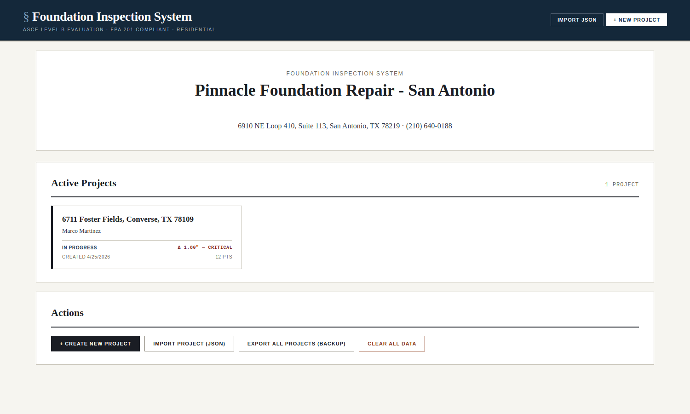
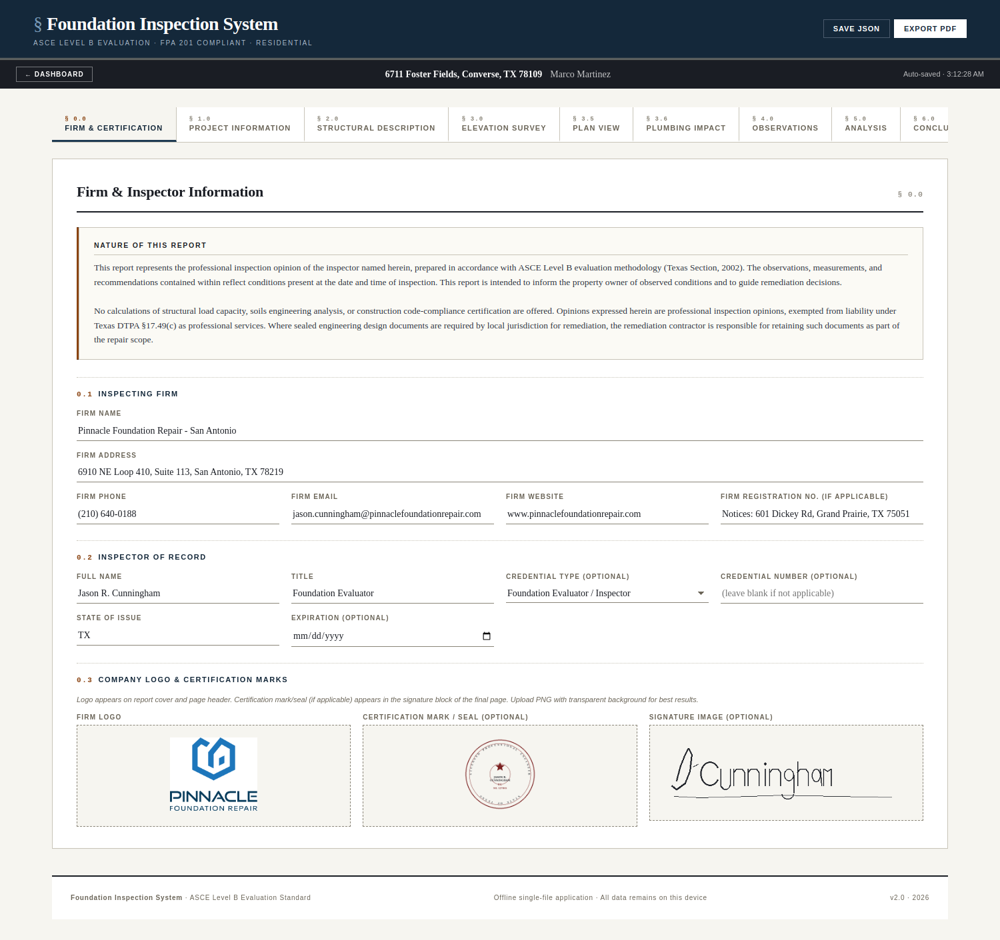
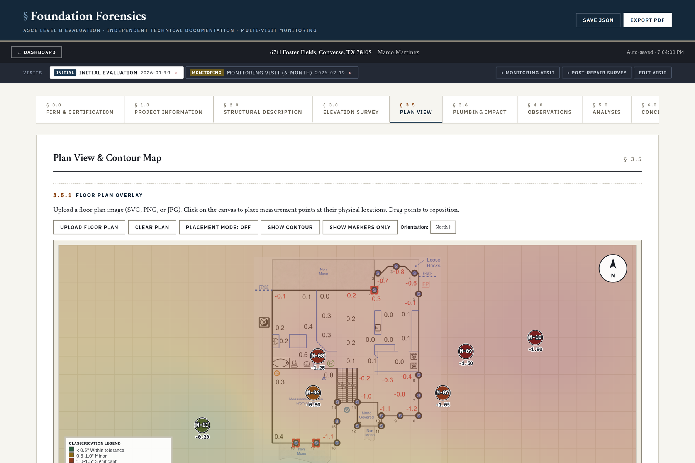
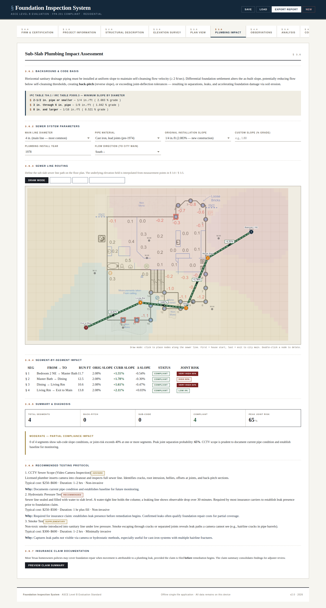
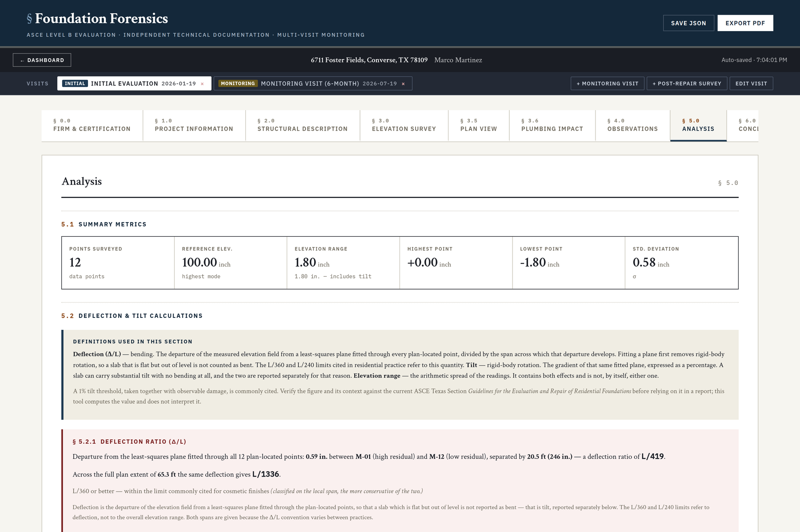
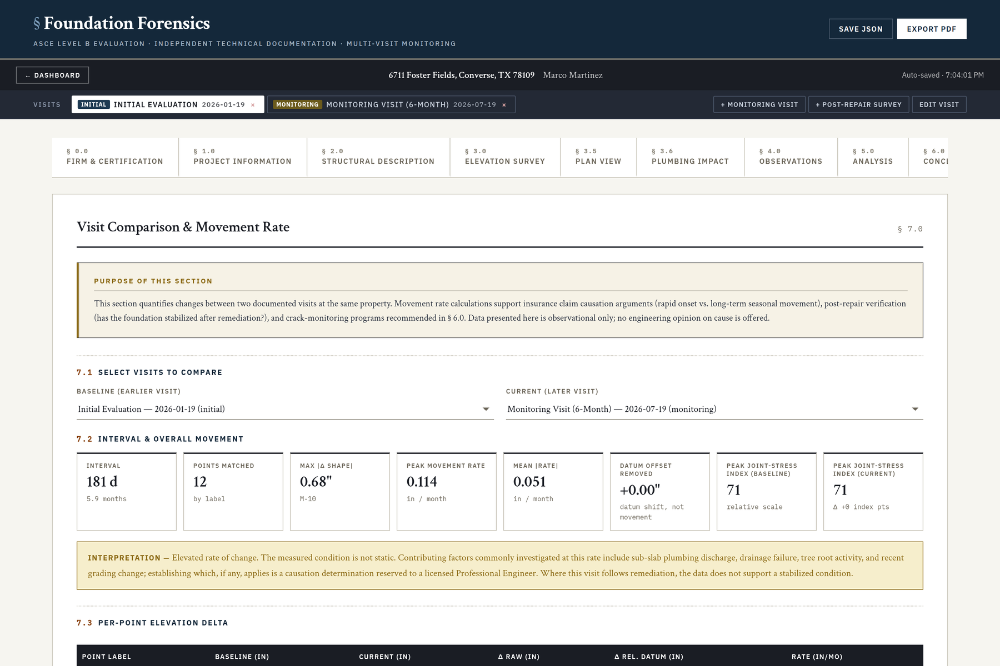

# Foundation Forensics

> An independent, calculation-driven ASCE Level B evaluation platform for residential foundation forensics. Field-deployable, fully offline, and built around **multi-visit time-series monitoring**, **field-test evidence integration**, and **raw-data export for licensed P.E. review**.


---

## What This Is

A single-file web application for **independent foundation evaluation firms** operating strictly as **technical documentation providers**. The tool is built around a specific business model: the firm performs no repair, no plumbing remediation, and no claim negotiation. It documents observed conditions in a form that supports the workflows of public adjusters, claims attorneys, and licensed Professional Engineers who consume the data.

Foundation Forensics is a v3 rewrite of an earlier repair-oriented tool ([Foundation Inspection System v2](https://github.com/)). The functional core — ASCE Level B elevation survey, plan-view contour rendering, sub-slab plumbing impact assessment — is preserved. The v3 changes are structural: the data model, disclaimer, and workflow are re-architected around independent forensic use.

---

## What Changed in v3

Four architectural additions define this release:

### 1. Multi-Visit Time-Series Architecture

Every project now supports an unbounded array of visits. Each visit is a full snapshot of §3.0 – §6.0 (elevation survey, plan view, plumbing impact, observations, analysis, conclusions), tied to a visit date and one of three visit types:

- **Initial** — first forensic evaluation of the property
- **Monitoring** — scheduled follow-up (typically 6-month or 12-month intervals)
- **Post-Repair** — verification survey after remediation is complete

The house-level fields (property, client, foundation description, firm, inspector) are shared across visits. Everything time-variant is per-visit.

The value proposition: movement rate documentation. A single-snapshot inspection cannot distinguish long-term seasonal drift from acute active movement. A monitoring visit six months later can — and that distinction is decisive in insurance claim causation arguments and post-repair verification.

### 2. Visit Comparison (§ 7.0)

A new report section that compares any two visits and computes:

- Interval in days and months
- Per-point elevation delta and rate (in/month)
- Peak movement rate across all matched points
- Peak plumbing joint-risk delta
- Interpretation banner tuned to Texas expansive-soil residential context

Points are matched by label across visits, so the inspector can re-measure the same grid on each follow-up.

### 3. Per-Segment Field-Test Evidence

The §3.6 Sub-Slab Plumbing Impact table now has an **Evidence** column per segment. Inspectors and public adjusters can attach:

- CCTV footage or still frames
- Hydrostatic test result PDFs
- Smoke test photos
- Field-observation notes

Each attachment lands on the specific segment (e.g., §2, Master Bath → Dining) where the finding was observed. The output binds the computed joint-stress index to documented field evidence in one report — which is the artifact insurance adjusters actually need. The index is a comparative screening value used to prioritize field verification; it is not a statistical probability and does not establish that a leak exists.

### 4. Raw Data Export for P.E. Review

A new export button emits elevation grid and plumbing segments as CSV, wrapped in a header identifying the property, firm, and inspector, with an explicit statement that **no engineering opinion is asserted in the file**. A licensed Texas Professional Engineer can review the data and issue a separate signed and sealed causation opinion, keeping the forensic firm cleanly within the technical-documentation scope of practice.

---

## Added Since v3.0

**v3.0.2 — Visual exhibits.** § 3.6 now generates three exhibits on screen and in the PDF: a plan overlay of the sewer routing colour-coded by slope classification, per-segment side-view slope profiles (as-designed vs. current vs. IPC minimum, with settlement arrows and back-pitch pooling zones), and a bell-and-spigot joint diagram carrying the property's worst-segment values.

**v3.1.0 — Contours and site geology.** Plan view gained discrete 0.25″ settlement bands on a divergent palette plus marching-squares iso-settlement contours with a dashed zero-movement line. § 2.3.1 Site Geology added a one-click USDA SSURGO fetch — the property address is geocoded through the U.S. Census geocoder, the parcel's dominant map unit is pulled from Soil Data Access, and map unit, component, plasticity index range, linear extensibility, and drainage are cached into the project with a dated source citation. An embedded database of ~24 Bexar-and-adjacent NRCS series covers the offline case.

**v3.2.0 — Forensic-neutral language, proprietary license.** Auto-generated repair-prescriptive text was replaced with findings that state what was measured and refer causation and remedial scoping to a licensed P.E. "Joint separation probability (%)" became the **joint-stress index**, explicitly a comparative screening scale rather than a statistical probability. The license moved from MIT to proprietary.

**v3.4.0 — The arithmetic says what it means.** A verification pass recomputed the calculation engine independently. § 5.2 had been computing *tilt* — the elevation range over a span — and labelling it *deflection*, then classifying it against the L/360 and L/240 limits, which are bending limits: a slab that was flat but out of level read as bent, and § 5.2.1 and § 5.2.2 turned out to be the same number over two different denominators. Deflection is now the departure from a least-squares plane fitted through the plan-located points, with tilt reported separately as that plane's gradient. The pixel-to-foot scale that every segment run and span depends on was hardcoded at 20 px/ft and duplicated as a bare `0.05` in two other places; § 3.5.2 now calibrates it against a known distance, and until it is calibrated the report says plainly that its lengths are assumptions. Five separate implementations of "reference elevation" disagreed with each other; there is one now. See [`CHANGELOG.md`](CHANGELOG.md) for the full list, including what was checked and found correct.

**v3.3.0 — The report matches the software.** § 7.0 Visit Comparison, the flagship v3 feature, had never actually printed in the PDF; it does now, and the report's Limitations & Certification section moved to § 8.0 so the on-screen and printed numbering agree. Cross-visit comparison now normalizes each visit against its own reference point before computing any rate, so a change of survey datum can no longer masquerade as structural movement. The PDF engine is bundled into the file, making offline field use real rather than nominal. See [`CHANGELOG.md`](CHANGELOG.md) for the full list.

---

## Regulatory Positioning

The report disclaimer (first page of every PDF) declares three legal frames:

1. **Non-repair.** The firm performs no foundation repair, sub-slab plumbing repair, or any remediation, and holds no financial interest in repair decisions. This is a credibility position.

2. **Not an engineering opinion.** No opinion on causation, structural load capacity, soils analysis, or code compliance is offered. Where a signed and sealed opinion is required, a licensed Texas P.E. must review the data and issue a separate opinion under their own seal (Texas Occupations Code Chapter 1001; TBPE rules).

3. **Not claim negotiation.** The firm does not negotiate, adjust, or advocate any insurance claim. Under the Texas Insurance Code, only a licensed public adjuster or a licensed attorney may negotiate on behalf of a policyholder.

Opinions expressed are professional inspection opinions exempted from professional-services liability under **Texas DTPA § 17.49(c)**.

---

## Quick Start

**Try it in the browser** — no download:

- Application: <https://choij1104.github.io/foundation-forensics/foundation_forensics_v3.html>
- Preloaded demonstration: <https://choij1104.github.io/foundation-forensics/foundation_forensics_v3_demo_preloaded.html>

**Or run it locally:**

```
# Download & open (no install)
curl -O https://raw.githubusercontent.com/choij1104/foundation-forensics/main/foundation_forensics_v3.html
open foundation_forensics_v3.html     # macOS
xdg-open foundation_forensics_v3.html # Linux
start foundation_forensics_v3.html    # Windows
```

Or just download `foundation_forensics_v3.html` and double-click. Any modern browser works. No account, no server, and — as of v3.3.0 — no network dependency at all: the PDF engine is bundled into the file, so report generation works on a tablet with no signal. Web fonts load from the network when it is there and fall back to system fonts when it is not.

---

## Screenshots

Captured from the [preloaded demonstration](https://choij1104.github.io/foundation-forensics/foundation_forensics_v3_demo_preloaded.html) at v3.4.0.

| | |
|---|---|
| <br>**Dashboard** — projects with their measured differential and status. | <br>**§ 3.0 Elevation Survey** — readings with live deltas and severity. |
| <br>**§ 3.5 Plan View** — 0.25″ settlement bands and iso-settlement contours. | <br>**§ 3.6 Sub-Slab Plumbing Impact** — per-segment slope against IPC minimums, joint-stress index, field-test evidence. |
| <br>**§ 5.0 Analysis** — deflection against a fitted plane, reported separately from tilt. | <br>**§ 7.0 Visit Comparison** — movement rate between two visits, with the survey datum removed. |

---

## Data Model

```text
appState
├── firm          (shared across projects)
├── inspector     (shared across projects)
├── assets        (logo, seal, signature — shared)
├── activeProjectId
└── projects[]
    └── project
        ├── property        (house-level, shared across visits)
        ├── client          (house-level, shared across visits)
        ├── foundation      (house-level, shared across visits)
        ├── activeVisitId
        └── visits[]
            └── visit
                ├── visitId, visitDate, visitType, visitLabel
                ├── report          (per-visit)
                ├── site            (per-visit)
                ├── survey          (per-visit)
                ├── scope           (per-visit)
                ├── points[]        (per-visit — elevation readings)
                ├── observations    (per-visit — interior/exterior/drainage)
                ├── planPoints[]    (per-visit — plan positions)
                ├── planImage       (per-visit — usually copied from prior)
                └── plumbing
                    ├── pipeDiameter, material, year, flowDirection
                    ├── sewerNodes[]
                    └── segmentEvidence   ({ segKey: [{type, filename, dataUrl, note, timestamp}] })
```

Any v2 project imported into v3 is automatically wrapped as a single **Initial Evaluation** visit. Both legacy JSON export formats and legacy `localStorage` keys are recognized and migrated silently. See [`docs/migration_from_v2.md`](docs/migration_from_v2.md).

---

## Comparison with v2 and Competing Tools

| Capability                          | v3 Forensics | v2 Inspection | HomeGauge / Spectora | FPA Templates | AutoCAD |
|-------------------------------------|:------------:|:-------------:|:--------------------:|:-------------:|:-------:|
| Live elevation calculations         |     ✓        |      ✓        |         —            |       —       |    ✓    |
| Plan view contour visualization     |     ✓        |      ✓        |         —            |       —       |    ✓    |
| Sub-slab plumbing impact analysis   |     ✓        |      ✓        |         —            |       —       |    —    |
| **Multi-visit time-series**         |   **✓**      |      —        |         —            |       —       |    —    |
| **Per-segment field-test evidence** |   **✓**      |      —        |         —            |       —       |    —    |
| **Raw-data export for P.E.**        |   **✓**      |      —        |         —            |       —       |    —    |
| Independent-forensic disclaimer     |     ✓        |      —        |         —            |       —       |    —    |
| Offline operation                   |     ✓        |      ✓        |         —            |       ✓       |    ✓    |
| Recurring cost                      |   None       |    None       |    $60–$150/mo       |     None      | $1,500+/yr |

---

## File Structure

```
foundation-forensics/
├── index.html                             # GitHub Pages landing page
├── foundation_forensics_v3.html           # Main application (single file)
├── foundation_forensics_v3_demo_preloaded.html   # Built demo — do not hand-edit
├── build_demo.js                          # Reproducible build for the demo file
├── legacy/
│   └── foundation_v2_demo_preloaded.html  # v2 demo, the build input for build_demo.js
├── docs/
│   ├── overview.md                        # System overview
│   ├── usage_guide.md                     # User guide with multi-visit workflow
│   ├── migration_from_v2.md               # v2 → v3 migration notes
│   ├── forensic_positioning.md            # Business and regulatory positioning
│   └── screenshots/
│       ├── dashboard.png
│       ├── project_view.png
│       └── plumbing_tab.png
├── CHANGELOG.md
├── LICENSE
├── LICENSE_MIT_previous.txt               # The MIT terms that governed pre-3.2.0 releases
├── setup_github.sh
├── .gitignore
└── README.md
```

Rebuild the demo after any change to the application:

```
node build_demo.js     # reads legacy/foundation_v2_demo_preloaded.html + foundation_forensics_v3.html
```

---

## Roadmap

- [x] Multi-visit time-series architecture
- [x] Visit comparison with movement rate (§ 7.0)
- [x] Per-segment field-test evidence attachments
- [x] Raw-data export for P.E. consultant review
- [x] Forensic evaluator disclaimer (three legal frames)
- [x] Automatic migration from v2 storage and JSON exports
- [x] Mobile-responsive layout (v3.0.1)
- [x] Discrete settlement bands and iso-settlement contours (v3.1.0)
- [x] Site geology from USDA SSURGO, with embedded regional fallback (v3.1.0)
- [x] Visual exhibits A/B/C for sub-slab plumbing (v3.0.2)
- [x] § 7.0 Visit Comparison printed in the PDF report (v3.3.0)
- [x] Fully offline PDF generation — engine bundled, no CDN (v3.3.0)
- [x] Deflection separated from tilt, measured against a fitted plane (v3.4.0)
- [x] Plan-scale calibration, so distances in feet are measured rather than assumed (v3.4.0)
- [ ] Photo annotation on plan view
- [ ] Voice input for elevation readings
- [ ] Multi-language support (Korean / Spanish)
- [ ] Point-level uncertainty / instrument tolerance carried through the rate calculation

**Deliberately excluded**, per [`docs/forensic_positioning.md`](docs/forensic_positioning.md): load calculation, soils analysis,
and auto-generated remedial recommendations. Prescribing remediation is engineering judgment reserved to a licensed P.E., and
building it into the tool would put the firm outside its scope of practice. (This item appeared on earlier roadmaps as
"auto-generated recommendations"; it was removed in v3.3.0 rather than deferred.)

---

## License & Copyright

Copyright (c) 2026 Jae H. Choi. All rights reserved.

Foundation Forensics is **proprietary software — licensed, not sold**. No right to use,
copy, modify, distribute, sublicense, or create derivative works is granted except under a
separate written agreement with the copyright holder. Public visibility of this repository
is for demonstration and evaluation only and grants no deployment or commercial-use rights.
See [LICENSE](LICENSE) for full terms.

Reports and data exports generated with a licensee's own field data are the property of the
licensee or their client, as governed by their engagement agreement; this license governs
the software, not the professional work product created with it.

Third-party components: jsPDF (MIT). Public data services: USDA NRCS Soil Data Access and
the U.S. Census Bureau Geocoder, subject to their own terms; U.S. federal government data is
generally public domain and is attributed within generated reports.

> **Note on prior releases.** Versions of this repository published before v3.2.0 carried an
> MIT license. That grant cannot be retroactively revoked for copies already obtained under
> it; the proprietary terms apply to v3.2.0 and later.

## Acknowledgments

Built for the independent foundation evaluation workflow in Texas expansive-soil environments. Methodology draws on FPA-201 and the ASCE Texas Section *Guidelines for the Evaluation and Repair of Residential Foundations* (2002). Regulatory framing draws on Texas DTPA § 17.49(c), Texas Occupations Code Chapter 1001, TBPE rules, and the Texas Insurance Code chapters governing public adjusters.

---

*Foundation Forensics v3.4.0 · 2026 · ASCE Level B · Independent Technical Documentation*
